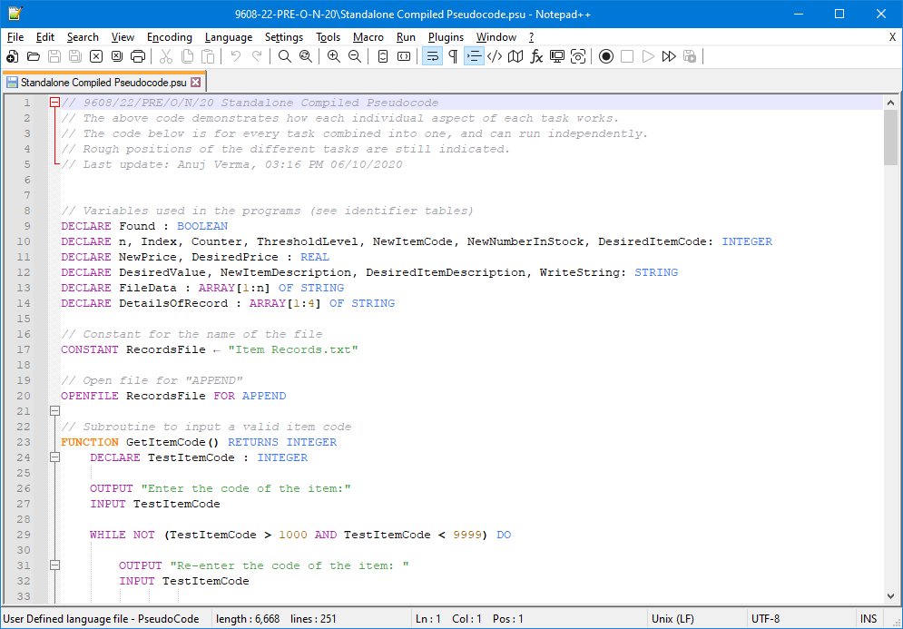

# NPP-Pseudocode-plugin
Pseudocode plug-in for Notepad++

Notepad++ is a text editor and source code editor for use with Microsoft Windows. It supports tabbed editing, which allows working with multiple open files in a single window. The project's name comes from the C increment operator. Notepad++ is distributed as free software.
Notepad++ makes it possible to define "languages", or more precisely, highlighting schemes (UDLs). This pseudocode plug-in is a custom-defined-language that provides syntax highlighting. It has been built for the Computer Science syllabuses of Cambridge International Assessment Education, specifically A Level 9608 and IGCSE 0478.

All instructions and other data mentioned here has been tested with Notepad++ v7.8.9 on a computer running Windows 10.

## Disclaimer
While all reasonable efforts have been made to ensure full compatibility with the syllabuses (and the author himself uses this for his own assignments and practice), this is not an official resource nor has it been endorsed by Cambridge International Assessment Education for any syllabus. Please use it at your own discretion. The author will not be responsible for any syllabus mismatches.

View installation instructions: https://github.com/eccentricOrange/NPP-CAIE-Pseudocode-Highlighting-plugin/blob/master/installation.md

### Dark themes
You will need to install a dark theme to Notepad++ if you want to use the dark theme provided with this extension (Pseudocode Dark Add-in.xml). You can either use the dark theme (Dark theme.xml) that ships with this extension, or use another one of your choice (Npp-1-Dark at URL https://github.com/60ss/Npp-1-Dark.git by 60ss is a great theme).
The official page at https://npp-user-manual.org/docs/themes/ explains clearly how to install themes.
NOTE: The dark theme Pseudocode file is not currently updated to match the last updated normal (white) theme.
